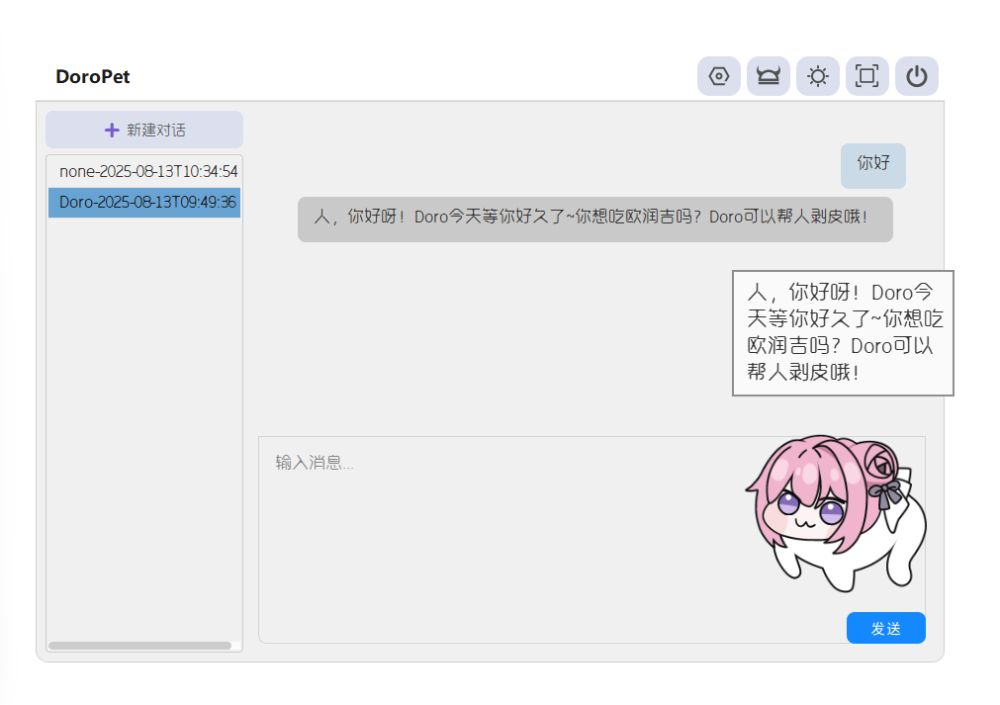
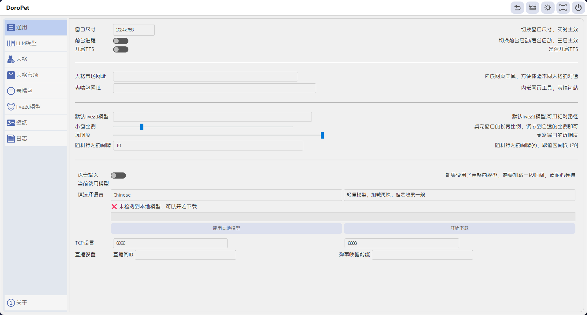
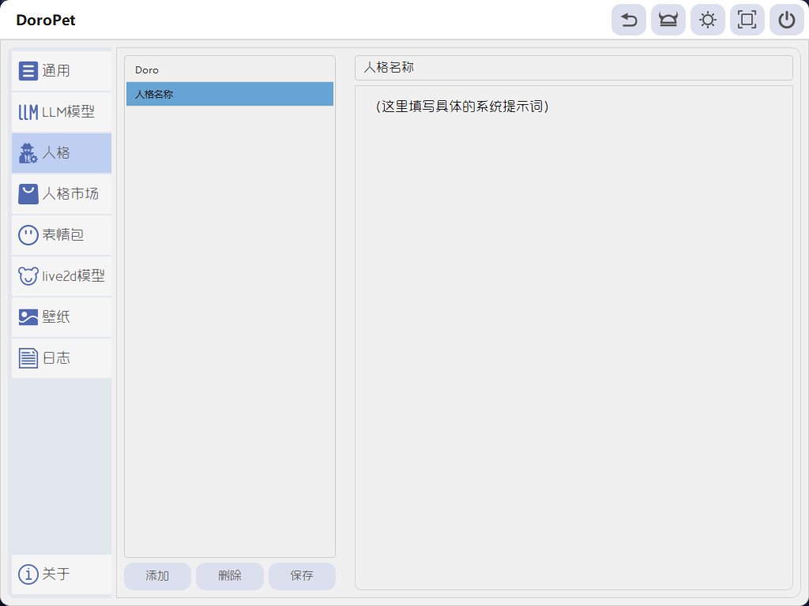
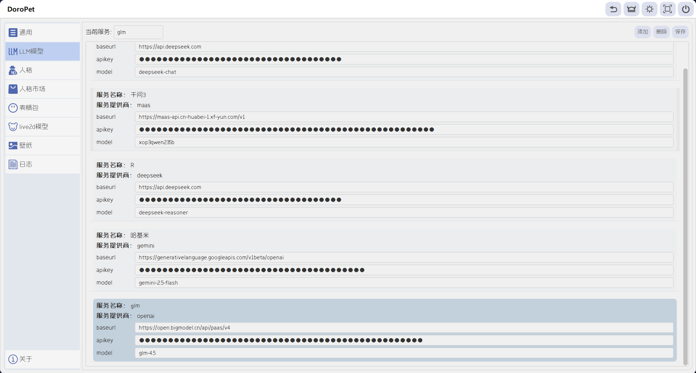

# DoroPet
一个Doro的桌面宠物，基于python和PyQt5，适配deepseek、Maas星火、千问、Gemini的api接口，自定义人格对话

## How to run

## Run for development
0. 安装[Python](https://www.python.org/downloads/)
1. 安装pipenv
```
pip install pipenv
```
2. 使用pipenv安装依赖
```
pipenv install
```
3. 进入pipenv的工作环境
```
pipenv shell
```
4. 打开可爱Doro
```
python main.py
```


## 版本日志
### V2.3
1.界面调整，部分配色细节优化，新增少许图标

2.增加MCP调用实现本地网页抓取，聊天中将自动使用

3.主页面中新增日志界面

4.修复部分已知bug


### V2.2
1.添加Doro边缘吸附，仅Doro模型生效

2.重构主动闲聊，可读配置文件thinktext.json，自定义回复语句和表情，仅Doro模型生效

3.新增聊天记录，聊天界面左侧可切换，新增会话，右键会话列表可选择删除（后续界面可升级）

4.快捷聊天支持回车发送，主页面聊天支持CTRL+回车发送

5.新增语音输入，仅支持vosk本地模型，可以在主页面通用设置安装模型，在主页面聊天界面会生成一个麦克风图标，点击开启语音输入，再次点击关闭

6.支持配置小窗口长宽比例，用于适配不同live2d模型

7.新增桌面壁纸功能，Win11：24H2以上系统无法使用，23H2本人测试OK; win10：本人测试OK

8.修复部分已知bug


### V2.1
1.移除原有天气，直接导入hefeng天气web界面。探索了更灵活的网页内容显示

2.添加人格市场，支持手动配置网址，用于提供更优质的人格提示词获取

3.新增live2d配置界面，可导入预览并应用到桌宠

4.全新的LLM服务配置界面。可支持传统的OPENAI接口。可以自由配置相同服务商的不同模型接口。（该页面此版本下只实现了基础功能，交互性有待提升）

5.新增托盘显示，隐藏主体


### V2.0
1.宠物主体改为Live2d模型，模型作者请见[Bilibili - 0x4682B4](https://www.bilibili.com/video/BV16z421B7HQ/?spm_id_from=333.337.search-card.all.click&vd_source=9bceeddd42a92116ea7719803b25e80f)
支持自动导入表情、动作。右键菜单切换


2.新增知心天气api获取


3.新增连连看小游戏


4.通用参数新增前台启动，方便直播的时候获取窗口进程


### V1.2
1.修复右键菜单中快捷聊天和自动切换的勾选显示错误，现在两个功能只能生效一个


### V1.1
1.新增Gemini适配，但是使用了openAI兼容模式，请勿填错信息，如果无响应，也可尝试检查网络环境

2.新增自动随机行为，每隔一段时间，会从（跳一下、切换动画、随机发言）中随机选择一种行为执行，与下一个功能会互斥

3.新增快捷聊天功能，在Doro下方生成输入框，发送消息后，Doro上方会生成一个回复，同时同步到聊天主对话框

### V1.0
实现基本功能

## 界面展示






## 使用注意
启用大模型聊天，需要在设置界面设置


## llmapi获取教程
[llmapi获取教程](examples/How to get llm API/getAPI.md)


## 模型获取地址
Maas
[直达](https://training.xfyun.cn/experience/text2text)

DeepSeek
[直达](https://platform.deepseek.com)

通义千问
[直达](https://bailian.console.aliyun.com/?spm=5176.30202035.J_5cDGbYTFXDvcuWnwVDdx7.1.370f1e71U1iaYl&tab=model#/model-market/detail/qwen3)
