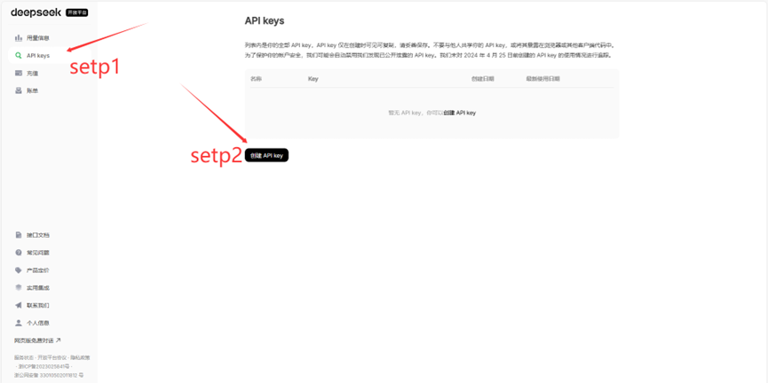

# 获取大模型api_key教程
       在当今AI技术蓬勃发展的时代，DeepSeek作为一款强大的AI服务提供平台，为开发者提供了丰富的API接口。通过获取DeepSeek API Key，您可以解锁各种AI能力，从智能对话到内容生成，从代码辅助到数据分析。本文将全面介绍如何获取DeepSeek API Key，包括官方渠道和第三方平台，以及使用中的安全注意事项和实用技巧，帮助您快速上手并充分利用这一强大工具。

### 认识DeepSeek API Key
    API Key（应用程序接口密钥）是访问DeepSeek AI服务的"数字钥匙"，它是一串唯一的字符组合，格式通常为"sk-"或"dsk-"开头，后接字母数字混合的长字符串（如dsk-5a3b2c1d0e9f8g7h6i5j4k）。这串密钥相当于您的身份凭证，每次调用DeepSeek API时都需要携带它进行验证。DeepSeek API采用按量计费模式，计价单位是Token（可理解为调用API需要的"代币"）。根据官方定价，DeepSeek-V3模型每100万输出Token收费8元，而R1模型每100万输出Token收费16元。一个汉字大约相当于3个Token，但具体消耗会根据模型版本、是否命中缓存等因素有所变化。
 
## 如何获取API
DeepSeek官方平台的API Key，每100万输出Token 8元（V3）/ 16元（R1），见下图，[信息传送门](https://api-docs.deepseek.com/zh-cn/quick_start/pricing)

 
### 一、(付费)DeepSeek官方平台
登录官方网址：https://platform.deepseek.com/  

微信扫码登陆，并填写相关信息。或者选择手机号登陆，系统会发送验证码到您的手机，输入验证码完成账号验证。部分情况下可能还需要进行邮箱验证
#### 1.登录并进入API管理页面
 

2.创建并复制你的api
创建api提交后，系统将立即生成一个唯一的API Key字符串。特别注意：这个Key只在创建时显示一次，关闭页面后将无法再次查看完整Key。因此务必立即复制并妥善保存。
 
 

## 二、白嫖API
### 1、通义千问（Qwen）
*  ​注册阿里云账号​​：完成实名认证后，进入[阿里云百炼平台](https://www.aliyun.com/product/bailian)，新用户可获 ​​100万Tokens​​ 免费额度，适用于Qwen基础模型调用
*  点击免费体验
  
* 新用户可以领到100万Tokens免费额度，点击领取
 
* 选择推理大模型，框选模型管理服务协议，然后点击领取额度

* 完成后点击左上方模型

* 再点击左下方api-key

* 创建API_KEY

* 填写相关信息并创建

* 点击查看你的api-key

* 复制你的api-key
